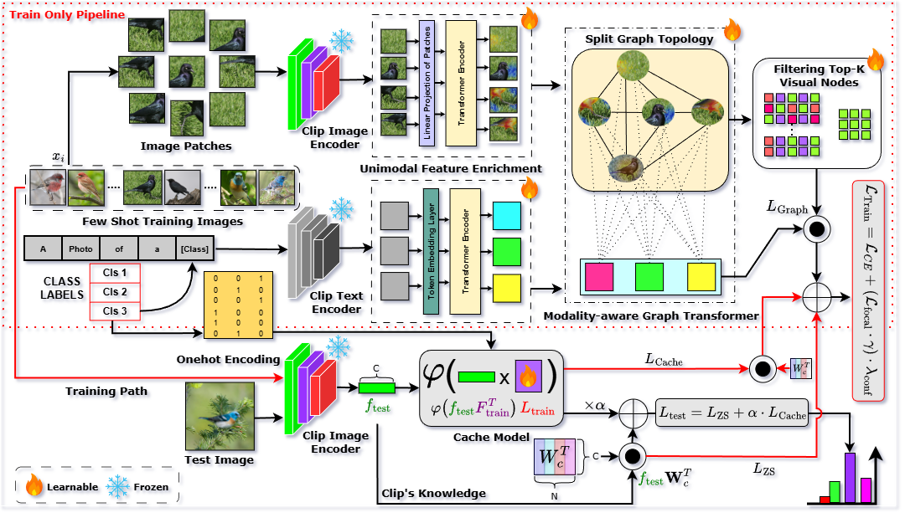

# TOGA: Training-Only Heterogeneous Image-Patch-Text Graph Supervision for Advancing Few-Shot Learning Adapters

[](#)
[](#)
[](#)
[](#)

**Official PyTorch Implementation of the CVPR 2026 paper: "Training-Only Heterogeneous Image-Patch-Text Graph Supervision for Advancing Few-Shot Learning Adapters"**

**Authors:** Mohammed Rahman Sherif Khan Mohammad, Ardhendu Behera, Sandip Pradhan, Swagat Kumar, Amr Ahmed  
**Institution:** Edge Hill University

---

## 🚨 Code Release Status
**The codebase is currently undergoing final cleanup for public release.** We will be uploading the full training pipelines, and evaluation scripts shortly. If you find our work interesting, please consider **Starring/Watching** this repository to get notified the moment the code drops!

## 📖 Abstract
Recent adapter-based CLIP tuning methods (e.g., Tip-Adapter) are strong few-shot learners that achieve efficiency by caching support features. However, these methods rely on global uni-modal feature vectors, overlooking fine-grained patch relations and their structural alignment with class text. 

**TOGA (Training-Only Graph Adapter)** bridges this gap without incurring inference costs by introducing a novel asymmetric training-only framework. Instead of altering the lightweight adapter, we construct a high-capacity auxiliary Heterogeneous Graph Teacher that operates *solely* during training. 

Through a cache-aware dual-objective strategy, this relational knowledge is distilled directly into the Tip-Adapter's key-value cache. At test time, the graph teacher is discarded, meaning **inference remains identical to Tip-Adapter with zero extra latency or memory**.

## ✨ Key Contributions
* **Asymmetric Supervision:** A novel training-only distillation framework coupling a Tip-Adapter key-value cache (student) with a high-capacity graph teacher, delivering zero test-time overhead.
* **Modality-aware Graph Transformer (MGT):** Deep bi-modal (visual and text) and hierarchical (image $\leftrightarrow$ patch) reasoning over a unified heterogeneous graph.
* **Cache-Aware Dual-Objective:** A co-training strategy utilizing Focal Loss as a teacher-forcing regularizer to ensure the auxiliary graph teacher acts as a robust expert.
* **State-of-the-Art Results:** Consistently establishes a new SOTA across 11 standard 1-16-shot benchmarks, beating both lightweight global-feature adapters and heavyweight patch-level adapters.

## 🧠 Method Overview



1. **Heterogeneous Graph Construction:** Integrates multi-scale visual patches and text prompts into a unified graph topology.
2. **Cross-Modal Reasoning:** MGT performs type-specific message passing over image $\leftrightarrow$ patch, patch $\leftrightarrow$ patch, image $\leftrightarrow$ text, and patch $\leftrightarrow$ text edges.
3. **Discriminative Node Filtering:** Extracts high-fidelity class features by retaining discriminative foreground patches and suppressing background noise.
4. **Zero-Overhead Inference:** The refined structural knowledge is supervised into the cache adapter; the teacher is discarded at deployment.

## 📊 Results Snapshot

TOGA establishes a new state-of-the-art across 11 benchmark datasets (ImageNet, SUN397, FGVC-Aircraft, EuroSAT, Stanford Cars, Food101, OxfordPets, Flowers102, Caltech101, DTD, UCF101).

| Method | 1-Shot Avg | 2-Shot Avg | 4-Shot Avg | 8-Shot Avg | 16-Shot Avg | Test-Time Overhead |
| :--- | :---: | :---: | :---: | :---: | :---: | :---: |
| Tip-Adapter-F | 64.3% | 66.1% | 69.1% | 73.3% | 75.8% | Zero |
| GraphAdapter | 62.7% | 67.8% | 69.8% | 71.4% | 74.4% | High |
| **TOGA (Ours)** | **72.2%** | **75.0%** | **77.9%** | **80.0%** | **82.3%** | **Zero** |

*(For full performance breakdowns and OOD generalization analysis, please refer to the main paper)*

## 🔗 Citation

If you find this research useful in your work, please consider citing our CVPR 2026 paper:

```bibtex
@inproceedings{khan2026toga,
  title={Training-Only Heterogeneous Image-Patch-Text Graph Supervision for Advancing Few-Shot Learning Adapters},
  author={Khan, Mohammed Rahman Sherif and Behera, Mohammad Ardhendu and Pradhan, Sandip and Kumar, Swagat and Ahmed, Amr},
  booktitle={Proceedings of the IEEE/CVF Conference on Computer Vision and Pattern Recognition (CVPR)},
  year={2026}
}
